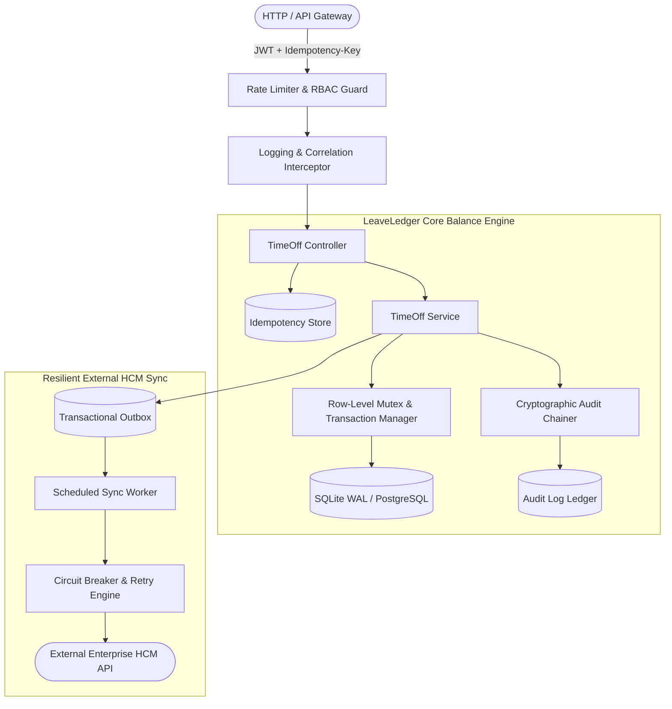
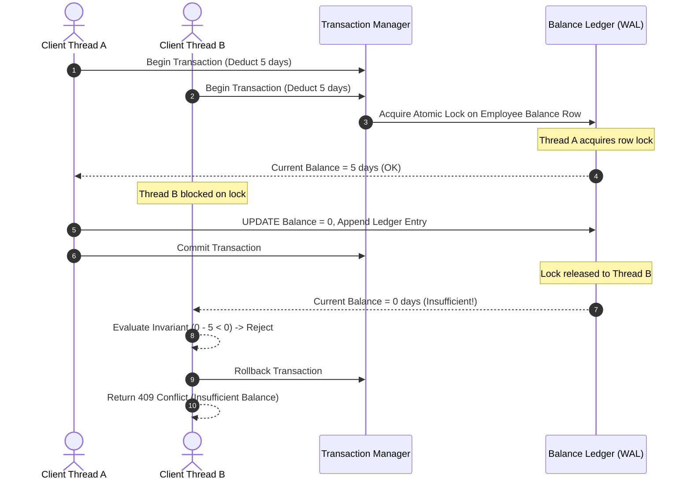
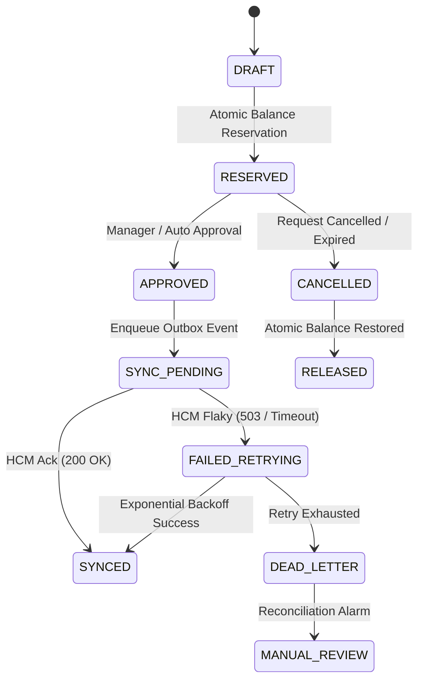
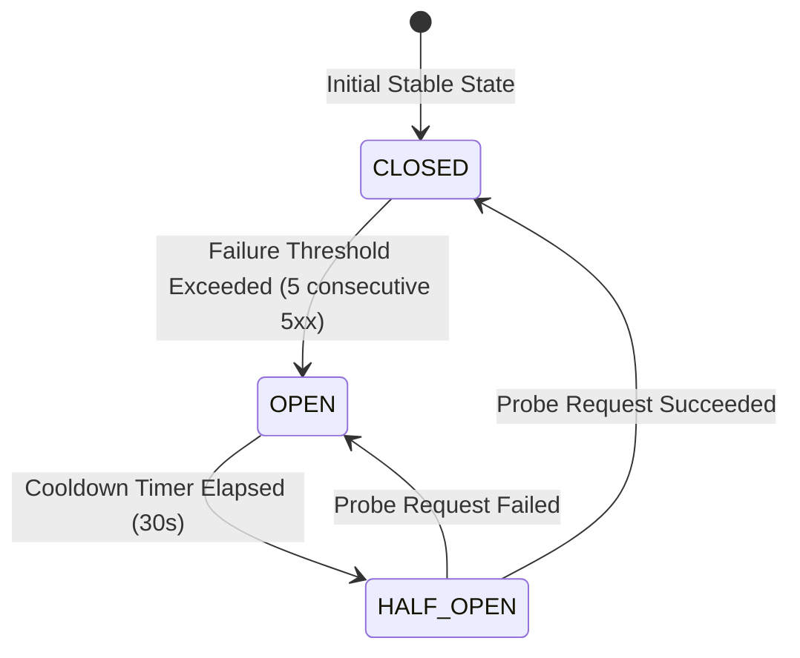

# 🏛️ LeaveLedger Architecture & Deep Engineering Specification

LeaveLedger is a high-reliability, concurrency-safe distributed leave and balance ledger microservice built on NestJS and TypeScript. It provides bank-grade transaction consistency, atomic balance reservations, cryptographic audit chains, and resilient synchronization with external Human Capital Management (HCM) systems.

---

## 1. System Overview & Core Principles



### Core Tenets
1. **Never Overdraw:** Under no concurrency race condition can an employee balance drop below zero.
2. **Strict Idempotency:** Any duplicate request with identical `Idempotency-Key` returns the original cached result without re-executing business mutations.
3. **Decoupled HCM Outbox:** External HCM network latency and outages never hold open internal database transactions.
4. **Tamper-Evident History:** All balance movements are recorded in an append-only cryptographic ledger where each record hashes the previous record's signature.

---

## 2. Concurrency Control & ACID Transaction Design



### Isolation Guarantees
- **SQLite:** Configured with `PRAGMA journal_mode = WAL; PRAGMA synchronous = NORMAL;`. Writers operate sequentially on the ledger table using exclusive write transactions, while readers execute non-blocking concurrently.
- **PostgreSQL Ready:** Configured for `SELECT ... FOR UPDATE` row-level pessimistic locking within `READ COMMITTED` or `REPEATABLE READ` transaction blocks.

---

## 3. The Two-Phase Balance Reservation Pattern

To prevent long-running external API calls from locking database rows, LeaveLedger implements a Two-Phase Reservation State Machine:



---

## 4. Resilient HCM Synchronization & Circuit Breaker



### Jittered Exponential Backoff
When synchronizing with external HCM endpoints, retries follow decorrelated exponential backoff with full jitter to avoid the "thundering herd" problem:

$$t_{	ext{delay}} = \min\left(t_{	ext{max}}, 	ext{random}(0, t_{	ext{base}} 	imes 2^{	ext{attempt}})
ight)$$

---

## 5. Cryptographic Audit Chain Specification

Every balance modification appends a tamper-evident audit record:

$$	ext{Hash}_n = 	ext{SHA256}\left(	ext{Hash}_{n-1} \,\|\, 	ext{Timestamp} \,\|\, 	ext{EmployeeID} \,\|\, 	ext{Action} \,\|\, 	ext{Delta} \,\|\, 	ext{PayloadHash}
ight)$$

If an adversary alters a database row in historical records, the chain signature becomes invalid:

```text
[Record 0 (Genesis)] -> Hash: 0000...a1b2
       |
[Record 1 (Set 20)]   -> PrevHash: 0000...a1b2 | Hash: 4e9f...c3d1
       |
[Record 2 (Deduct 5)] -> PrevHash: 4e9f...c3d1 | Hash: 8b2a...e7f0  <-- Tamper detected if altered!
```

---

## 6. Threat Model & Security Posture (STRIDE)

| Threat Category | Potential Vector | Mitigation in LeaveLedger |
| :--- | :--- | :--- |
| **Spoofing** | Forged employee headers | JWT validation with RS256 / HS256 signatures in AuthGuard. |
| **Tampering** | In-flight payload alteration | Strict DTO validation with `class-validator` (whitelist & forbid non-whitelisted properties). |
| **Repudiation** | Denying leave balance modification | Append-only SHA-256 chained audit logs signed with correlation ID. |
| **Information Disclosure** | Stack trace leaking on 500 errors | Centralized `AllExceptionsFilter` strips internal errors and formats RFC 7807 problem details. |
| **Denial of Service** | Rapid deduction spamming | Sliding window rate limiting and request deduplication middleware. |
| **Elevation of Privilege** | Employee approving own leave | Role-Based Access Control (RBAC) hierarchy enforcing `MANAGER` and `HR_ADMIN` permissions. |
